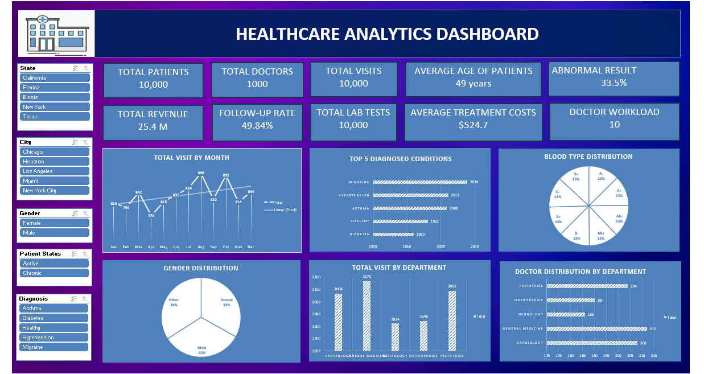
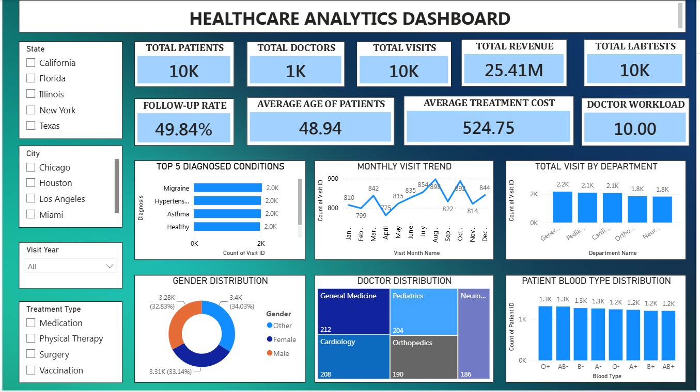
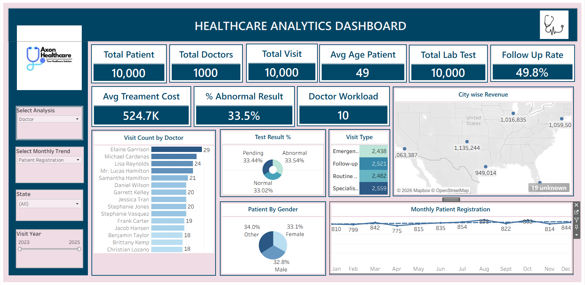

# Healthcare Analytics Dashboard

## Project Overview

This project was completed as part of the ExcelR Data Analytics Training Program and Data Analytics Internship at AI Variant.

The objective of this project was to analyze healthcare operational data and develop interactive dashboards that provide actionable insights into patient management, doctor utilization, diagnostic performance, treatment economics, and healthcare service efficiency.

Using SQL, Microsoft Excel, Power BI, and Tableau, healthcare data was transformed into meaningful business insights through KPI-driven analysis and interactive dashboards.

This project was completed collaboratively as part of an internship-based learning program, with contributions across data analysis, KPI development, dashboard creation, and business insight generation.

## Tools Used

- SQL
- Microsoft Excel
- Power BI
- Tableau

## Project Type

Industry-Oriented Healthcare Analytics Project completed during a Data Analytics Internship at AI Variant through the ExcelR Data Analytics Training Program.

## My Contributions

- Performed data cleaning and transformation
- Developed SQL queries for healthcare data analysis
- Created KPIs to measure healthcare performance
- Built dashboards using Microsoft Excel, Power BI, and Tableau
- Analyzed patient, doctor, diagnostic, and revenue metrics
- Generated business insights and recommendations
- Contributed to project documentation and presentation

## Key Performance Indicators (KPIs)

- Total Patients
- Total Doctors
- Total Visits
- Total Revenue
- Total Lab Tests
- Follow-Up Rate
- Average Patient Age
- Average Treatment Cost
- Percentage of Abnormal Lab Results
- Doctor Workload
- Top 5 Diagnosed Conditions
- Department-wise Visit Analysis
- Monthly Patient Registration Trend

## Dashboard Screenshots

### Excel Dashboard

### Power BI Dashboard

### Tableau Dashboard

## Key Insights

- Healthcare operations served 10,000 patients through a network of 1,000 doctors, resulting in 10,000 recorded patient visits.

- Total healthcare revenue reached 25.41M, reflecting strong operational performance and service utilization.

- Follow-up adherence rate was 49.84%, indicating that nearly half of all patient visits required continued monitoring and care.

- The average patient age was 48.94 years, representing a balanced adult patient population.

- Approximately 33.5% of laboratory test results were classified as abnormal, highlighting the importance of diagnostic monitoring and preventive healthcare initiatives.

- Average treatment cost per visit was 524.75, providing valuable insights into healthcare expenditure and treatment economics.

- Doctor workload averaged 10 visits per physician, indicating balanced utilization of healthcare resources.

- General Medicine recorded the highest visit volume among departments, while Pediatrics, Cardiology, Orthopedics, and Neurology also contributed significantly to patient care delivery.

- Monthly patient registrations remained relatively stable throughout the year, with peak activity observed around August.

- Gender distribution remained balanced, with Male, Female, and Other categories each representing approximately one-third of the patient population.

- Migraine, Hypertension, Asthma, Diabetes, and Healthy Checkups emerged as the most common diagnosed conditions.

## Repository Contents

- SQL Queries
- Excel Dashboard
- Power BI Dashboard
- Tableau Dashboard
- Dashboard Screenshots

## Business Recommendations

- Improve follow-up management programs to increase patient retention and continuity of care beyond the current 49.84% follow-up rate.

- Investigate abnormal laboratory results to identify high-risk patient groups and support early intervention strategies.

- Optimize physician scheduling and workforce allocation based on department-wise visit volumes and doctor workload metrics.

- Expand healthcare services in high-performing regions while improving outreach in lower-performing geographic areas.

- Monitor treatment costs and resource utilization to maintain quality healthcare while controlling operational expenses.

- Implement dashboard-based KPI monitoring for real-time healthcare performance tracking and faster decision-making.

- Strengthen data governance and reporting standards to improve healthcare reporting accuracy and support strategic planning.

## Conclusion

The Healthcare Analytics Dashboard provides a comprehensive view of healthcare operations, patient engagement, doctor utilization, diagnostic performance, and financial outcomes.

By leveraging SQL, Excel, Power BI, and Tableau, the project enables healthcare stakeholders to make informed decisions, improve operational efficiency, optimize resource utilization, and enhance patient care quality through data-driven insights.
